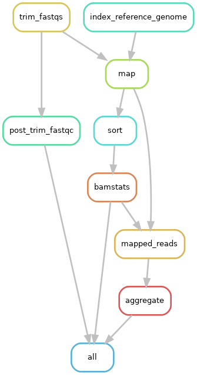

# Consensus fasta bug fix

Pipeline not outputting a consensus fasta file as expected

## Before any changes

```bash
snakemake --configfile config/config-flu-only.json -k -j 16 -n
```

Dryrun output

```bash
Job stats:
job                       count    min threads    max threads
----------------------  -------  -------------  -------------
aggregate                    16              1              1
all                           1              1              1
bamstats                     16              1              1
index_reference_genome        4              1              1
map                          16              1              1
mapped_reads                 16              1              1
post_trim_fastqc              4              1              1
sort                         16              1              1
trim_fastqs                   4              1              1
total                        93              1              1

This was a dry-run (flag -n). The order of jobs does not reflect the order of execution.
```

Looks like the aggregate rule is set to run

## Debugging

I changed this if else statement from https://github.com/seattleflu/assembly/blob/master/Snakefile#L31 to https://github.com/leahkemp/assembly/blob/master/Snakefile#L31 to avoid an error, I suspect that is where Snakemake doesn't continue since it's got it output file specified in the if-else statement

Try reverting back to the original if-else statement:

```python
        if not all_segments_aligned or mapped <= min_reads:
            return rules.not_mapped.output.not_mapped
        else:
            return rules.post_masked_consensus_and_summary_stats_to_id3c.output.successful_post
```

```bash
snakemake --configfile config/config-flu-only.json -k -j 16 -n
```

Dryrun works, and I get the same jobs to be completed

```bash
Job stats:
job                       count    min threads    max threads
----------------------  -------  -------------  -------------
aggregate                    16              1              1
all                           1              1              1
bamstats                     16              1              1
index_reference_genome        4              1              1
map                          16              1              1
mapped_reads                 16              1              1
post_trim_fastqc              4              1              1
sort                         16              1              1
trim_fastqs                   4              1              1
total                        93              1              1
```

Try a full run

```bash
snakemake -j 20 -k -w 60 \
--configfile config/config-flu-only.json \
--cluster-config config/cluster.json \
--cluster "sbatch -A lkemp -p prod --nodes=1 --tasks=1 --mem={cluster.memory} --cpus-per-task={cluster.cores} --time={cluster.time} -o all_output.out"
```

Errored out with

```bash
InputFunctionException in line 201 of /home/lkemp/test_seattleflu_pipeline/assembly/Snakefile:
Error:
  AttributeError: 'Rules' object has no attribute 'post_masked_consensus_and_summary_stats_to_id3c'
Wildcards:
  reference=vic_Brisbane_60_2008
  sample=19CF0981
Traceback:
  File "/home/lkemp/test_seattleflu_pipeline/assembly/Snakefile", line 34, in aggregate_input
```

It can't find anything from that rule since that rule is currently commented out, I think this error is actually un-related

Run again with original if-else statement

```python
        if not all_segments_aligned or mapped <= min_reads:
            return rules.not_mapped.output.not_mapped
        else:
            return rules.not_mapped.output.not_mapped
```

Ran through fine as expected, but it's not running the rules we want that will create a consensus fasta file, looks like this will be created ultimately by rule vcf_to_consensus (https://github.com/leahkemp/assembly/blob/master/Snakefile-base#L345). I'll aim to get the pipeline to run through to this step.

Create a rulegraph to visualise workflow

```bash
rm -rf process
rm -rf summary
rm -rf benchmarks
snakemake --rulegraph --configfile config/config-flu-only.json | dot -Tpng > rulegraph_1.png
```



It's not evaluating the rules we want, next step to tackle this would be to try and convince Snakemake to run these rules
